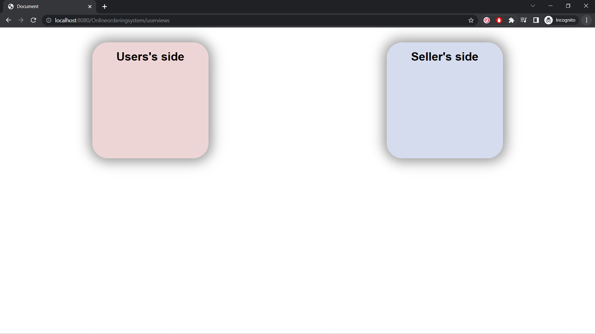

# Digital-Ordering-System-Spring-MVC
Its a Spring MVC project that show two webpages one on the customer's side for placing the order and another for the seller's side to view the order. An additional webpage was introduced in order to make it easy for the user to switch btw the two sides (for further development by the programmer).

### This is the page that help in order to navigate between the pages and perform various test cases with ease..
